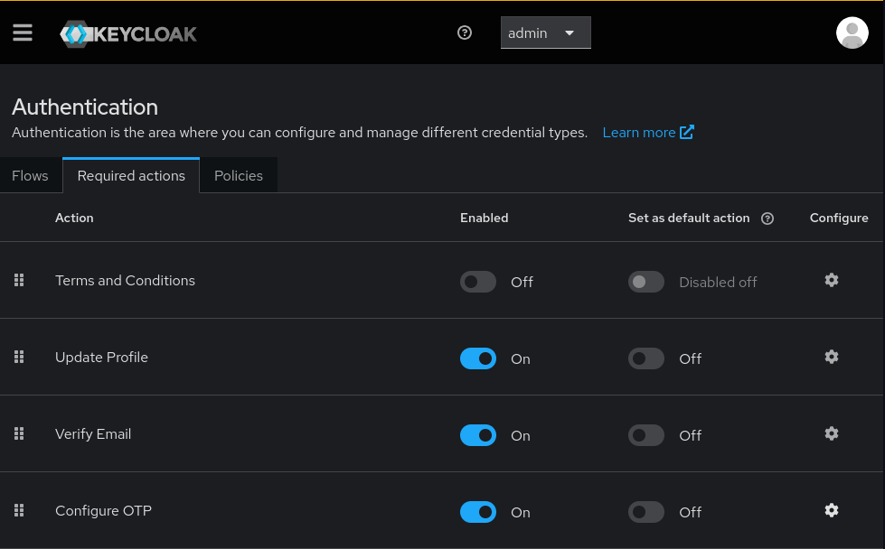
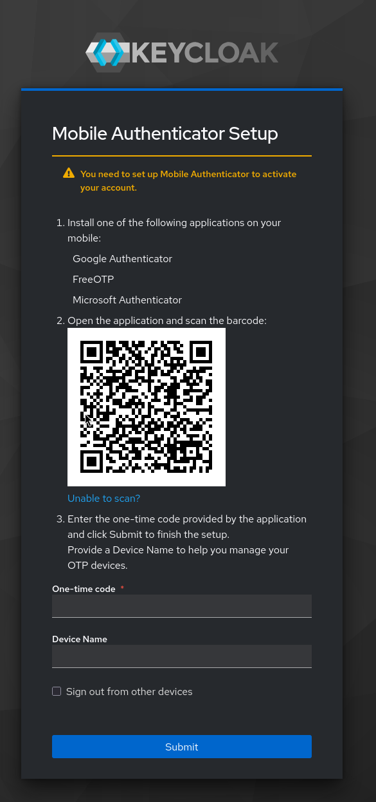
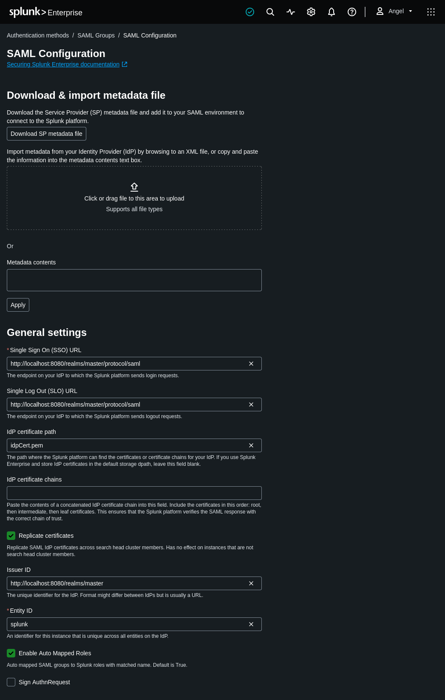
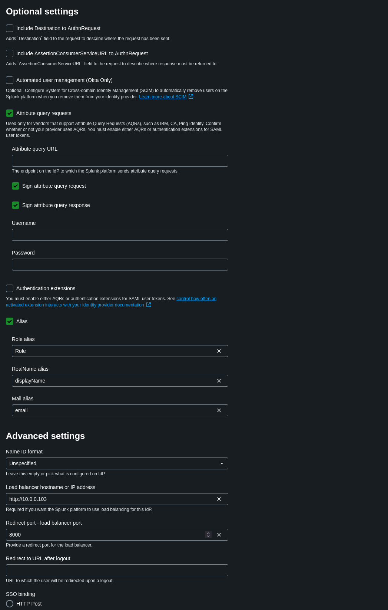
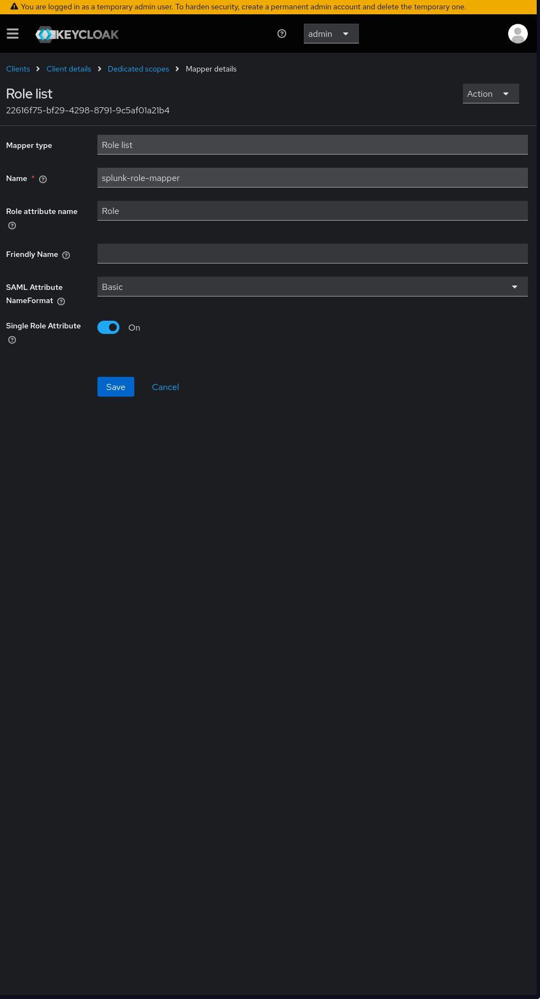
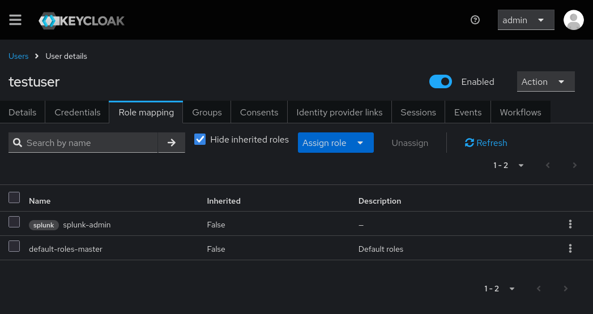
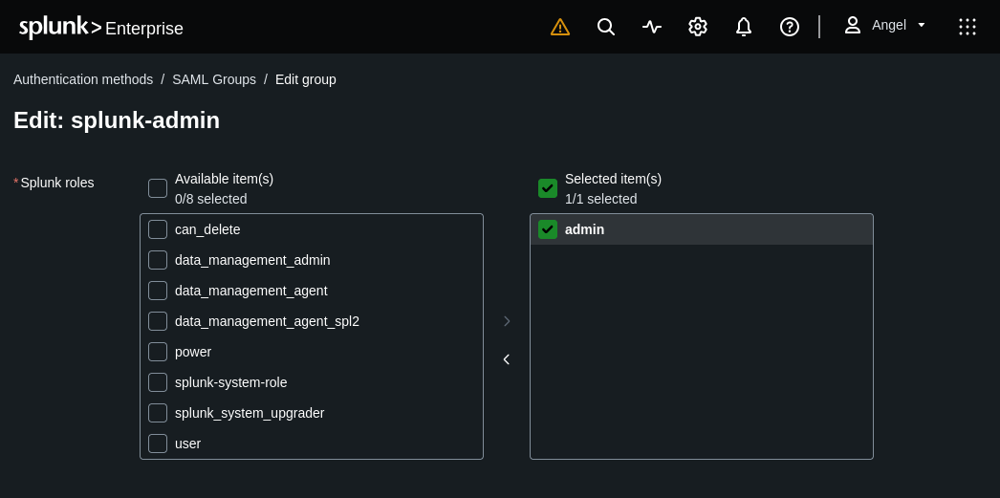
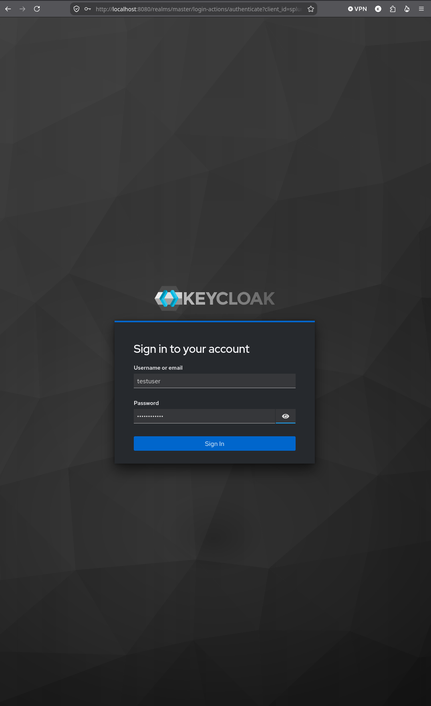
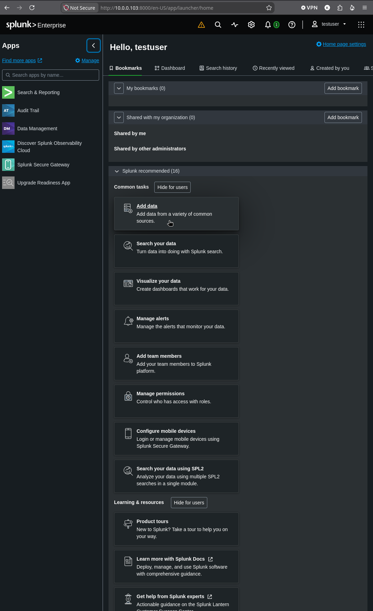

# Enterprise Identity & Access Management (IAM) Lab

## Executive Summary
This project demonstrates the end-to-end engineering of a modern Zero-Trust architecture. The environment establishes a centralized directory backend, provisions a Single Sign-On (SSO) security gateway with mandatory Multi-Factor Authentication (MFA), and federates identity across enterprise services using SAML and dynamic Role-Based Access Control (RBAC).
## Architecture & Technologies
*   **Hypervisor & Networking:** Proxmox VE, pfSense, Tailscale
*   **Infrastructure as Code (IaC):** Terraform, Cloud-Init
*   **Configuration Management:** Ansible
*   **Identity Services:** 389 Directory Server (LDAP), Keycloak (SSO/IdP)
*   **Security & Telemetry:** Splunk Enterprise, Splunk Universal Forwarder, Firewalld

---

## Phase 1: Enterprise Directory Services

**Objective:** 
Establish a centralized identity database to serve as the backend for an enterprise Single Sign-On (SSO) environment.

**Engineering Execution:**
*   **Automated Provisioning:** Utilize my pre-existing Proxmox Automation IaC pipeline to provision a dedicated Fedora node (`10.0.0.106`) within a segmented Proxmox virtual environment.
*   **Idempotent Configuration:** Develop an Ansible playbook to automate the deployment of a **389 Directory Server**. The playbook handles package dependencies, generates the silent `.inf` answer file, and provisions the initial database structure.
*   **Host-Based Security:** Integrate `firewalld` management directly into the Ansible pipeline, ensuring the host drops all traffic except explicit LDAP (TCP/389) and LDAPS (TCP/636) connections.

## Phase 2: Single Sign-On (SSO) & Zero-Trust Identity Gateway

**Objective:** 
Deploy an enterprise Identity Provider (IdP) using Keycloak, federate identity management with the backend 389 Directory Server across segmented subnets, and enforce Zero-Trust access controls including Multi-Factor Authentication (MFA) and strict password policies.

**Engineering Execution:**
*   **Infrastructure & Containerization:** Provision a dedicated Fedora node (`10.0.0.107`) and orchestrate the automated installation of Docker CE and firewalld via Ansible (`deploy_keycloak.yml`) to deploy the official Keycloak image in a containerized runtime exposing port 8080/tcp.
*   **LDAP User Federation:** Connect Keycloak to the 389 Directory Server (`10.0.0.106`) to synchronize user accounts, enforcing the LDAP database as the centralized, read-only source of truth.
*   **Zero-Trust Policy Enforcement:** Implement administrative password complexity controls (minimum length, numerical, and special character requirements) and enforce mandatory Time-Based One-Time Password (TOTP) authentication for all users.
*   **End-to-End Access Verification:** Validate the authentication pipeline by provisioning a test user into the LDAP backend, syncing the record across the gateway, and verifying mandatory QR-code hardware token enrollment upon initial user sign-in.

**Validation & Visual Evidence:**

### 1. Containerized Service Deployment
The Keycloak gateway running in a healthy, isolated Docker container environment:

### 2. Directory Server Federation
Successful LDAP bridge binding Keycloak to the 389 Directory Server backend (`10.0.0.106:389`):

### 3. Identity Security Policies
Enforcing password complexity standards and mandatory Multi-Factor Authentication (MFA):

### 4. Zero-Trust Enforcement & Token Registration
The identity gateway intercepting unauthenticated sessions and enforcing mandatory TOTP authenticator setup:

## Technical Challenges & Resolutions
*   **Host Virtualization Optimization:** Configure CPU instruction passthrough (`type = "host"`) within Terraform to satisfy `x86-64-v2` architecture requirements for modern containerized runtimes.

# Phase 3: Single Sign-On (SSO) & Role-Based Access Control (RBAC) via SAML

## Overview
In this phase of the Identity and Access Management (IAM) lab, Keycloak is configured as a SAML Identity Provider (IdP) to provide centralized authentication and authorization for Splunk Enterprise. This integration eliminates the need for isolated local accounts, enforces enterprise MFA policies at the gateway, and dynamically assigns administrative capabilities in Splunk based on Keycloak identity roles.

## 1. Establishing the SAML Trust
To establish federation, Splunk's Service Provider (SP) metadata is imported directly into Keycloak, mapping the exact Entity ID and Assertion Consumer Service (ACS) endpoints.

On the Splunk side, Identity Provider parameters are configured to point to the local Keycloak infrastructure.

## 2. Role-Based Access Control (RBAC)
Instead of managing permissions inside the application layer, authorization is managed centrally at the IdP (Keycloak). Keycloak is configured to pass user roles to Splunk during the SAML login process.

The custom `splunk-admin` role is assigned to the directory test user (`testuser`) in Keycloak.

Splunk is configured to intercept the `splunk-admin` SAML group assertion and elevate the user session to the internal `admin` role, granting full administrative privileges upon successful authentication.

## 3. End-User Authentication & Security Enforcement
With the federation established, Splunk delegates all authentication prompts to Keycloak. 

The enterprise security posture remains strictly enforced at the gateway. The user must authenticate using the centralized directory credentials (389 Directory Server) and pass the required One-Time Password (OTP) MFA challenge previously established.

## 4. Verification and Access
Upon successful authentication, token exchange, and role processing, the user successfully lands on the Splunk dashboard authenticated as `testuser`, fully inheriting the mapped administrative roles.

## Technical Challenges & Resolutions
* **ACS Redirect Whitelisting:** Initial authentication requests fail with `invalid_redirect_uri` errors until Keycloak is forcefully synchronized with Splunk's native SP metadata XML file, strictly aligning the allowed redirect arrays.
