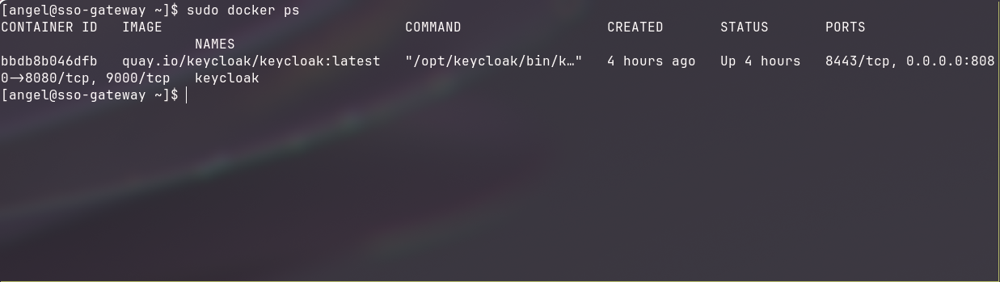
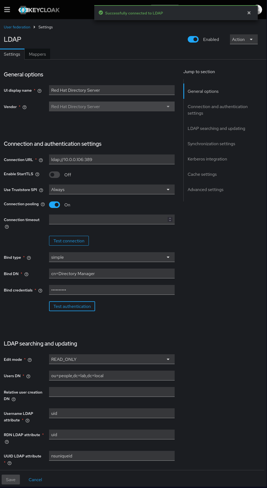
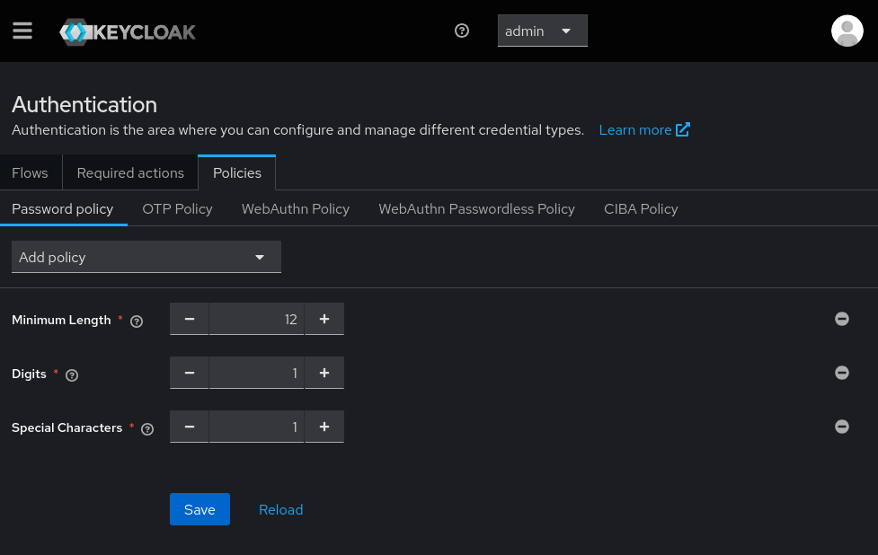
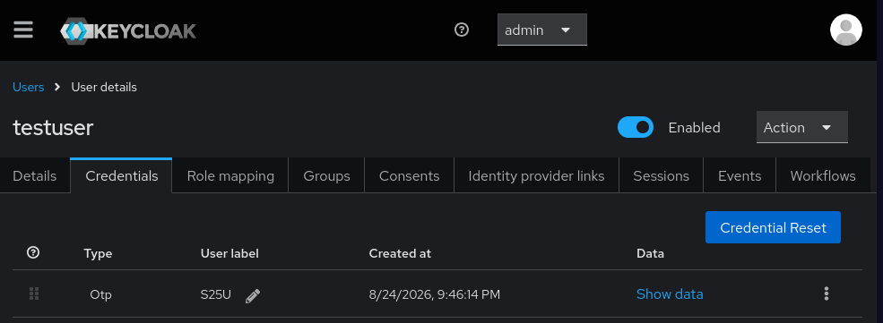

# Enterprise Identity & Access Management (IAM) Lab

## Executive Summary
This project demonstrates the end-to-end engineering of a modern Zero-Trust architecture. I deploy a centralized directory backend, configure a Single Sign-On (SSO) security gateway with Multi-Factor Authentication (MFA), and aggregate authentication telemetry into a SIEM for threat detection.

## Architecture & Technologies
*   **Hypervisor & Networking:** Proxmox VE, pfSense, Tailscale
*   **Infrastructure as Code (IaC):** Terraform, Cloud-Init
*   **Configuration Management:** Ansible
*   **Identity Services:** 389 Directory Server (LDAP), Keycloak (SSO/IdP)
*   **Security & Telemetry:** Splunk Enterprise, Splunk Universal Forwarder, Firewalld

---

## Phase 1: Enterprise Directory Services

**Objective:** 
Establish a centralized identity database to serve as the backend for an enterprise Single Sign-On (SSO) environment.

**Engineering Execution:**
*   **Automated Provisioning:** Utilized my pre-existing Proxmox Automation Infrastructure-as-Code pipeline to provision a dedicated, lightweight Fedora node within a segmented Proxmox virtual environment.
*   **Idempotent Configuration:** Developed an Ansible playbook to automate the deployment of **389 Directory Server**. The playbook handles package dependencies, generates the silent `.inf` answer file, and provisions the initial database structure.
*   **Host-Based Security:** Integrated `firewalld` management directly into the Ansible pipeline, ensuring the host drops all traffic except explicit LDAP (TCP/389) and LDAPS (TCP/636) connections.
*   **Network Segmentation Validation:** Verified the strict network isolation of the directory server by attempting external connections, successfully confirming that pfSense drops unrouted external traffic.

## Phase 2: Single Sign-On (SSO) & Zero-Trust Identity Gateway

**Objective:** 
Deploy an enterprise Identity Provider (IdP) using Keycloak, federate identity management with the backend 389 Directory Server across segmented subnets, and enforce Zero-Trust access controls including Multi-Factor Authentication (MFA) and strict password policies.

**Engineering Execution:**
*   **Infrastructure & Containerization:** Provisioned a dedicated Fedora node (`10.0.0.107`) and orchestrated the automated installation of Docker CE and `firewalld` using Ansible (`deploy_keycloak.yml`). Deployed the official Keycloak image in a containerized runtime, exposing port 8080/tcp.
*   **Host Virtualization Optimization:** Configured CPU instruction passthrough (`type = "host"`) within Terraform to satisfy `x86-64-v2` architecture requirements for modern containerized runtimes.
*   **LDAP User Federation:** Connected Keycloak to the 389 Directory Server (10.0.0.106) to synchronize user accounts, enforcing the LDAP database as the centralized, read-only source of truth.
*   **Zero-Trust Policy Enforcement:** Implemented administrative password complexity controls (minimum length, numerical, and special character requirements) and enforced mandatory Time-Based One-Time Password (TOTP) authentication for all users.
*   **End-to-End Access Verification:** Validated the authentication pipeline by provisioning a test user into the LDAP backend, syncing the record across the gateway, and verifying mandatory QR-code hardware token enrollment upon initial user sign-in.

**Validation & Visual Evidence:**

### 1. Containerized Service Deployment
The Keycloak gateway running in a healthy, isolated Docker container environment:

### 2. Directory Server Federation
Successful LDAP bridge binding Keycloak to the 389 Directory Server backend (`10.0.0.106:389`):

### 3. Identity Security Policies
Enforcing password complexity standards and mandatory Multi-Factor Authentication (MFA) across the realm:

### 4. Zero-Trust Enforcement & Token Registration
The identity gateway intercepting unauthenticated sessions and enforcing mandatory TOTP authenticator setup:

